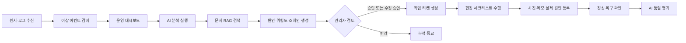
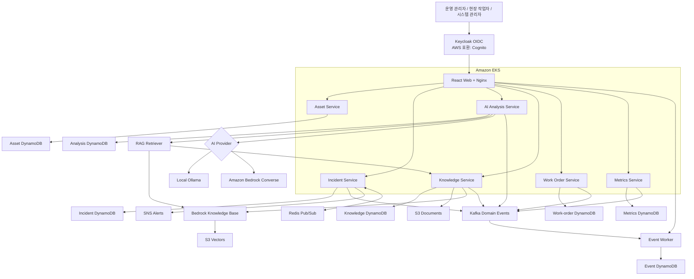

# AX Sentinel

> AI 기반 제조 설비 장애 대응 플랫폼

AX Sentinel은 제조 설비에서 발생하는 센서 이상과 오류 로그를 수집하고,
정비 매뉴얼 및 과거 장애 사례를 검색하여 장애 원인 후보와 안전한 조치 계획을
생성하는 플랫폼입니다.

AI는 설비를 직접 조작하지 않습니다. 분석 결과는 운영 관리자의 검토와 승인을
거쳐 작업 티켓으로 전환되며, 현장 작업자가 점검 결과와 실제 장애 원인을
등록해야 장애를 완료할 수 있습니다.

## 현재 구현 범위

- Python 3.12 및 FastAPI 기반 마이크로서비스 7개
- React 19, TypeScript, Vite 기반 운영 웹 콘솔
- 센서 데이터 수신, DynamoDB 저장 및 WebSocket 실시간 모니터링
- 임계치 초과 자동 감지, 가상 장애 생성과 장애 상태 관리
- Amazon Bedrock Converse 기반 장애 원인 및 조치안 생성
- Ollama 기반 로컬 한국어 장애 분석과 JSON Schema 구조화 출력
- S3 문서 저장과 Bedrock Knowledge Bases 기반 RAG
- Kafka 도메인 이벤트, consumer group·멱등 처리 이력, SNS 위험 경보와
  Redis Pub/Sub
  다중 Pod fan-out
- 관리자 승인·수정 승인·반려, 작업 티켓, 증빙 사진과 복구 확인
- AI 분석 정확도 및 조치안 유용성 피드백
- 서비스별 Prometheus HTTP 메트릭
- Keycloak OIDC/PKCE 로그인과 Realm role 기반 권한 제어
- Docker Compose 및 LocalStack 로컬 개발 환경
- Terraform 기반 AWS VPC, EKS, ECR, Cognito, DynamoDB, S3와 Bedrock 구성
- Helm 기반 Kubernetes 배포, HPA, PDB, NetworkPolicy와 ALB Ingress

## AI 도입 개요

### 도입 배경

제조 설비 장애 대응은 센서값, 오류 로그, 설비 정보, 정비 이력과 매뉴얼이
서로 다른 위치에 분산되어 있어 원인 판단과 초동 조치 수립에 시간이 걸립니다.
또한 숙련자의 경험에 의존할수록 교대조와 담당자에 따라 판단 품질이 달라질 수
있습니다.

AX Sentinel은 AI를 설비 제어기가 아닌 **진단 의사결정 지원 도구**로
도입했습니다. AI는 현장 정보를 모아 원인 후보와 조치 초안을 제시하고,
최종 판단과 위험 작업 승인은 사람이 담당합니다.

### 적용 범위

| 적용 지점 | AI가 하는 일 | 확인 메뉴 |
| --- | --- | --- |
| 장애 분석 | 센서·로그·설비·정비 이력과 관련 문서를 종합 | 장애 관리 → AI 원인 분석 |
| 원인 추론 | 위험도, 원인 후보, 신뢰도와 근거 생성 | 장애 상세 및 AI 분석 |
| 조치안 작성 | 순서가 있는 점검·조치 계획과 위험 작업 여부 생성 | 장애 상세 및 AI 분석 |
| 지식 활용 | 정비 매뉴얼과 과거 장애 사례를 RAG로 검색 | 문서 관리 |
| 안전 검토 | 저신뢰도·근거 부족 분석을 전문가 검토 큐로 분류 | 전문가 검토함 |
| 품질 개선 | 정답 데이터셋과 현장 피드백으로 정확도·유용성 평가 | AI 운영 지표 |

임계값 초과 및 연속 이상 감지는 설명 가능한 규칙 기반 로직입니다. AI는
이상이 감지된 이후의 원인 분석과 조치안 생성에 사용됩니다.

### 입력과 출력

```text
입력
  센서 요약 + 오류 로그 + 설비 정보 + 정비 이력 + 검색 문서
    ↓
RAG 검색
  관련 정비 매뉴얼 및 과거 장애 사례
    ↓
Ollama 또는 Bedrock
  위험도 + 원인 후보 + 신뢰도 + 근거 + 권장 조치
    ↓
안전 정책
  전문가 검토 + 관리자 승인 + 작업 티켓
```

AI 응답은 JSON Schema로 구조화해 API와 화면에서 동일한 형식으로 사용합니다.
각 분석에는 모델 ID, 프롬프트 버전·해시, 검색 문서 버전, Guardrail 결과와
토큰 사용량을 저장하여 재현과 감사를 지원합니다.

### 모델 운영 전략

| 환경 | AI 구성 | 목적 |
| --- | --- | --- |
| 현재 LocalStack EKS | Ollama `hoangquan456/qwen3-nothink:4b` | 로컬 한국어 분석, 비용 없는 기능 검증 |
| 자동화 테스트 | `deterministic-mock-v1` | 빠르고 재현 가능한 회귀 검사 |
| AWS 개발·운영 | Amazon Bedrock Converse + 선택적 Guardrail | 관리형 모델, 확장성, 운영 통제 |

현재 로컬 환경은 Ollama를 기본으로 사용하며 DynamoDB 문서 검색을 결합합니다.
실제 AWS 배포에서는 같은 분석 인터페이스를 Bedrock과 Knowledge Base로
교체할 수 있습니다.

### 기대 효과와 검증 지표

AI 도입 효과는 단순 답변 생성 건수가 아니라 장애 대응 결과로 평가합니다.
아래 값은 운영 실적이 아닌 파일럿 단계의 초기 목표이며, 정답 데이터셋과
현장 피드백이 누적되면 설비군별 기준으로 재조정합니다.

| 기대 효과 | 측정 지표 | 파일럿 목표 |
| --- | --- | --- |
| 원인 탐색 시간 단축 | 기존 대비 평균 해결 시간 감소율 | 30% 이상 |
| 원인 후보 품질 향상 | 정답 데이터셋 원인 후보 정확도 | 70% 이상 |
| 근거 기반 분석 강화 | 기대 문서 Top-K 검색 적중률 | 80% 이상 |
| 조치안 현장 활용 | 승인·수정 승인 비율 | 70% 이상 |
| 현장 만족도 향상 | 조치안 유용성 평가 | 평균 4.0/5 이상 |
| 안전 통제 유지 | 고위험 조치의 무승인 실행 | 0건 |
| 감사 가능성 확보 | 버전·근거가 저장된 분석 비율 | 100% |

평가 시 데이터셋 크기, 설비 종류, 장애 난이도, 모델·프롬프트 버전을 함께
기록해야 서로 다른 조건의 결과를 잘못 비교하지 않습니다.

### 기대하지 않는 범위와 안전 원칙

- AI는 설비를 직접 정지·가동하거나 제어 신호를 전송하지 않습니다.
- AI 결과는 확정 원인이 아니라 검토가 필요한 원인 후보입니다.
- 고위험 조치는 관리자의 승인 없이는 작업 티켓으로 실행할 수 없습니다.
- 신뢰도 70% 미만 또는 관련 문서가 없는 분석은 전문가 검토 대상으로
  자동 분류합니다.
- 소형 로컬 모델은 중복·부정확한 조치를 생성할 수 있어 JSON 검증, 중복
  제거, RAG 근거, 전문가 검토와 현장 피드백을 함께 사용합니다.
- 예지보전 수명 예측과 이상 감지 모델 학습은 현재 범위가 아니며, 축적된
  시계열 데이터와 정답 라벨이 확보된 이후 별도 모델로 확장합니다.

## 주요 사용자

| 사용자 | 주요 기능 |
| --- | --- |
| 운영 관리자 | 장애 확인, AI 분석 실행, 조치안 승인·수정·반려 |
| 현장 작업자 | 작업 티켓 수행, 체크리스트·사진·메모·실제 원인 등록 |
| 시스템 관리자 | 사용자·문서·AI 운영 설정 및 전체 관리 |

역할명은 `operator_manager`, `field_worker`, `system_admin`입니다. LocalStack
EKS에서는 Keycloak Realm role을 사용하고, AWS 호환 모드에서는 같은 역할을
Cognito group claim으로 변환합니다.

## 업무 흐름



## 시스템 구성



각 백엔드 서비스는 독립적인 FastAPI 애플리케이션과 Kubernetes Deployment로
실행됩니다. EKS에서 `인스턴스` 역할을 하는 실행 단위는 각 서비스의 Pod이며,
EC2 Managed Node Group은 Pod가 공유하는 컴퓨팅 기반입니다.

## 기술 스택

| 영역 | 기술 |
| --- | --- |
| Web | React 19, TypeScript, Vite, Nginx, oidc-client-ts |
| Backend | Python 3.12, FastAPI, Pydantic, Uvicorn |
| AI | 로컬 Ollama, Amazon Bedrock Converse API, 선택적 Bedrock Guardrail |
| RAG | Amazon Bedrock Knowledge Bases, S3 Vectors, Amazon S3 |
| Data | 서비스별 Amazon DynamoDB, S3, Apache Kafka, SNS, Redis Pub/Sub |
| Auth | LocalStack EKS: Keycloak / AWS: Cognito 호환, OIDC + PKCE, JWT/JWKS |
| Local | Docker Compose, LocalStack Pro, LocalStack EKS |
| Platform | Amazon EKS, ECR, VPC, Pod Identity |
| IaC | Terraform, Helm, Kubernetes |
| Observability | 현재: Prometheus endpoint·Kubernetes probe / 목표: EFK·OpenTelemetry |
| Quality | pytest, Ruff, TypeScript compiler, Vite build |

## 서비스

| 서비스 | 책임 | 로컬 Swagger |
| --- | --- | --- |
| `asset-service` | 설비 정보와 상태 | `http://localhost:8101/docs` |
| `incident-service` | 실시간 센서 수신, 가상 장애, 장애 상태 | `http://localhost:8102/docs` |
| `ai-analysis-service` | RAG 근거 기반 AI 분석과 안전 정책 | `http://localhost:8103/docs` |
| `knowledge-service` | 문서 업로드, 검색, Bedrock 색인 동기화 | `http://localhost:8104/docs` |
| `work-order-service` | 승인, 작업 티켓, 현장 작업 완료 | `http://localhost:8105/docs` |
| `metrics-service` | AI 평가 피드백과 운영 지표 | `http://localhost:8106/docs` |
| `event-worker` | Kafka consumer group, event ID 멱등 처리, topic·partition·offset 이력 | `http://localhost:8107/docs` |
| `web` | React 운영 콘솔과 API 프록시 | `http://localhost:3000` |
| `localstack` | 로컬 AWS 호환 게이트웨이 | `http://localhost:4566` |

## 웹 화면

- 로그인
- 운영 대시보드
- 실시간 데이터
- 설비 관리
- 장애 관리
- 장애 상세 및 AI 분석
- 작업 티켓
- 문서 관리와 검색
- AI 운영 지표

`실시간 데이터` 화면은 수신된 센서값, 임계치 상태, 최근 로그와 파형을
WebSocket으로 즉시 갱신합니다. 화면 진입 시 최근 100건만 HTTP로 불러오고
그 이후 데이터는 `ws://<host>/api/v1/telemetry/ws`로 수신합니다. 자동으로
감지된 장애는 `ws://<host>/api/v1/incidents/ws`를 통해 대시보드와 장애
목록에 즉시 반영됩니다. Kubernetes에서는 Redis Pub/Sub이 여러 Incident
Service Pod 사이의 메시지를 fan-out합니다.

자동 감지 규칙은 다음과 같습니다.

- `critical`: 첫 임계치 초과 샘플에서 즉시 장애 생성
- `warning`: 동일 설비·센서에서 연속 3회 감지되면 장애 생성
- 정상 샘플: 해당 연속 감지 횟수 초기화
- 미해결 상태의 동일 설비·센서 자동 장애: 중복 생성 억제

`데모 스트림 시작` 버튼을 누르면 로컬 테스트 데이터가 약 1.5초 간격으로
생성됩니다.

## 빠른 시작

### 사전 요구사항

- Docker Desktop
- PowerShell 7 권장
- 로컬 전체 실행에는 AWS 계정이나 자격 증명이 필요하지 않습니다.

### 전체 스택 실행

저장소 루트에서 실행합니다.

```powershell
Set-Location C:\pj\AXSentinel
.\scripts\stack.ps1 start
```

모든 컨테이너가 `healthy`가 되면 브라우저에서 다음 주소를 엽니다.

```text
http://localhost:3000
```

로컬 로그인 화면에서 사용할 역할을 선택한 후 `로컬 콘솔 시작`을 누릅니다.

### 상태와 로그 확인

```powershell
.\scripts\stack.ps1 status
.\scripts\stack.ps1 logs
```

### 재시작과 종료

```powershell
.\scripts\stack.ps1 restart
.\scripts\stack.ps1 stop
```

`stop`은 컨테이너를 제거하지만 LocalStack 볼륨은 유지하므로 DynamoDB와 S3
데이터가 보존됩니다.

### LocalStack만 실행

```powershell
.\scripts\localstack.ps1 start
.\scripts\localstack.ps1 status
.\scripts\localstack.ps1 logs
```

로컬 데이터를 완전히 초기화하려면 다음 명령을 사용합니다.

```powershell
.\scripts\localstack.ps1 reset
```

주의: `reset`은 LocalStack 볼륨과 그 안의 DynamoDB, S3 데이터를 모두
삭제합니다.

### LocalStack EKS에 전체 서비스 배포

실제 AWS 계정 대신 LocalStack Pro가 제공하는 EKS 환경에 클러스터와 Managed
Node Group을 만들고, 7개 FastAPI 서비스와 React 웹을 각각 Kubernetes
Deployment로 실행할 수 있습니다. LocalStack 인증 토큰은 현재 PowerShell
세션의 환경 변수로만 전달하며 저장소에 기록하지 않습니다.

```powershell
$env:LOCALSTACK_AUTH_TOKEN="<your-localstack-auth-token>"
.\scripts\local-eks.ps1 deploy
```

배포 스크립트는 다음 작업을 멱등적으로 수행합니다.

1. LocalStack Pro 시작
2. `ax-sentinel-local` EKS 클러스터와 `ax-sentinel-workers` Node Group 생성
3. 로컬 컨테이너 이미지 빌드
4. LocalStack ECR repository 생성 및 이미지 push
5. Helm release `ax-sentinel` 설치 또는 업데이트
6. Node, Pod, Service, Ingress 상태 출력

배포 상태는 언제든 다시 확인할 수 있습니다.

```powershell
.\scripts\local-eks.ps1 status
kubectl get pods -n ax-sentinel
```

배포가 끝나면 다음 주소에서 EKS에 올라간 React 화면을 엽니다.

```text
http://localhost:8081
```

좌측 메뉴의 `Kafka 관리`를 누르면 인증이 적용된 Kafbat UI가 새 탭으로
열립니다. 토픽 메시지, partition/offset, consumer group lag와 DLQ를
브라우저에서 확인할 수 있습니다.

```text
http://localhost:8081/kafka-ui
사용자명: admin
비밀번호: .local/keycloak-credentials.json의 kafkaUiPassword
```

Docker Compose 웹(`http://localhost:3000`)과 포트를 분리했으므로 두 환경을
동시에 비교할 수 있습니다. 애플리케이션 데이터 리전은
`ap-northeast-2`를 유지합니다. LocalStack ECR 주소만 로컬 TLS 인증서와
호환되는 `us-east-1` registry hostname을 사용합니다.

### 실시간 센서 데이터 지속 발생

EKS의 Incident API로 센서 데이터와 로그를 1초 간격으로 계속 전송합니다.
실행 중인 터미널에서 `Ctrl+C`를 누르면 발생기가 종료됩니다.

```powershell
.\scripts\telemetry-producer.ps1
```

다른 주소나 전송 주기를 사용할 수도 있습니다.

```powershell
.\scripts\telemetry-producer.ps1 `
  -Endpoint "http://localhost:8081/api/v1/telemetry" `
  -IntervalMilliseconds 1000
```

## 로컬 모드와 AWS 모드

| 기능 | 로컬 Docker Compose | LocalStack EKS | AWS/EKS |
| --- | --- | --- | --- |
| 인증 | 비활성 역할 시뮬레이션 | Keycloak OIDC + PKCE | Cognito 호환 OIDC + PKCE |
| AI 분석 | Ollama | Ollama `qwen3-nothink:4b` | Bedrock Converse |
| RAG | DynamoDB 저장 텍스트 검색 | DynamoDB 저장 텍스트 검색 | Bedrock Knowledge Bases |
| 데이터 | LocalStack DynamoDB/S3 | LocalStack DynamoDB/S3 | AWS DynamoDB/S3 |
| 센서 갱신 | HTTP + WebSocket | HTTP + WebSocket/Redis | HTTP + WebSocket/Redis |
| 실행 환경 | Docker Compose | LocalStack EKS Pod | EKS Pod + HPA |

Docker Compose의 역할 선택은 편의용 시뮬레이션이다. LocalStack EKS에서는
Keycloak이 실제 access token을 발급하고 FastAPI가 역할을 검증한다.

## 환경 변수

기본값을 변경할 때만 `.env.example`을 `.env`로 복사합니다.

```powershell
Copy-Item .env.example .env
```

| 변수 | 로컬 기본값 | 설명 |
| --- | --- | --- |
| `AWS_REGION` | `ap-northeast-2` | AWS 리전 |
| `AWS_ENDPOINT_URL` | Compose에서 LocalStack 주소 지정 | AWS SDK endpoint override |
| `DYNAMODB_TABLE` | 서비스별 Helm/Compose 설정 | 해당 서비스가 소유한 DynamoDB 테이블 |
| `DOCUMENTS_BUCKET` / `S3_BUCKET` | `axsentinel-local` | 문서 저장 버킷 |
| `AUTH_MODE` | Compose: `disabled`, LocalStack EKS: `keycloak` | `disabled`, `keycloak` 또는 `cognito` |
| `COGNITO_USER_POOL_ID` | 없음 | Cognito User Pool ID |
| `COGNITO_CLIENT_ID` | 없음 | Cognito Web Client ID |
| `OIDC_ISSUER` | Helm이 설정 | Keycloak token issuer |
| `OIDC_JWKS_URL` | Helm이 설정 | FastAPI Pod가 접근할 Keycloak JWKS URL |
| `OIDC_CLIENT_ID` | `ax-sentinel-web` | Keycloak audience/client ID |
| `AI_PROVIDER` | `ollama` | `ollama`, `mock` 또는 `bedrock` |
| `OLLAMA_BASE_URL` | `http://host.docker.internal:11434` | Ollama API 주소 |
| `OLLAMA_MODEL` | `hoangquan456/qwen3-nothink:4b` | 로컬 분석 모델 |
| `OLLAMA_TIMEOUT_SECONDS` | `180` | Ollama 분석 제한 시간 |
| `BEDROCK_MODEL_ID` | 없음 | Bedrock 모델 또는 inference profile ID |
| `BEDROCK_GUARDRAIL_ID` | 없음 | 선택적 Guardrail ID |
| `BEDROCK_GUARDRAIL_VERSION` | 없음 | Guardrail 버전 |
| `RAG_PROVIDER` | `local` | `local` 또는 `bedrock` |
| `BEDROCK_KNOWLEDGE_BASE_ID` | 없음 | Bedrock Knowledge Base ID |
| `BEDROCK_DATA_SOURCE_ID` | 없음 | Bedrock Data Source ID |
| `SQS_QUEUE` | `axsentinel-events` | 이벤트 큐 |
| `SQS_DLQ` | `axsentinel-events-dlq` | 3회 처리 실패 메시지 격리 큐 |
| `EVENT_BUS` | LocalStack EKS: `kafka` | `disabled`, `kafka`, `sqs` 또는 `dual` |
| `KAFKA_BOOTSTRAP_SERVERS` | `kafka:9092` | Kafka broker 목록 |
| `KAFKA_CONSUMER_GROUP` | `ax-sentinel-event-worker-v1` | Event Worker consumer group |
| `SNS_TOPIC` | `axsentinel-alerts` | 경보 토픽 |
| `WEBSOCKET_BROKER` | `memory` | `memory` 또는 `redis` |
| `REDIS_URL` | 없음 | Redis Pub/Sub 접속 URL |

웹 컨테이너는 시작할 때 `AUTH_MODE`, issuer와 client ID로 `/ax-config.js`를
생성한다. Cognito와 Keycloak public client 모두 Authorization Code + PKCE를
사용하며 client secret을 웹에 포함하지 않는다.

### 실제 AWS Cognito·Bedrock 통합 점검

LocalStack EKS에서는 Keycloak과 로컬 Ollama를 사용합니다. 실제 Cognito와
Bedrock 검증은 개발용 AWS 계정의
유효한 자격 증명과 Terraform 출력값을 환경 변수로 지정하면 읽기 전용 구성
검사, OIDC discovery/JWKS, 선택적 로그인, Bedrock 호출과 Knowledge Base
검색까지 한 번에 검증할 수 있습니다. `AWS_ENDPOINT_URL`이 남아 있으면 실제
AWS 점검이 아니므로 스크립트가 즉시 중단합니다.

```powershell
Remove-Item Env:AWS_ENDPOINT_URL -ErrorAction SilentlyContinue
$env:COGNITO_USER_POOL_ID = "<user-pool-id>"
$env:COGNITO_CLIENT_ID = "<client-id>"
$env:BEDROCK_MODEL_ID = "<model-or-inference-profile-id>"
$env:BEDROCK_KNOWLEDGE_BASE_ID = "<knowledge-base-id>"
$env:BEDROCK_DATA_SOURCE_ID = "<data-source-id>"

# STS, Cognito, OIDC, Knowledge Base 구성 검사
.\.venv\Scripts\python.exe scripts/aws-integration-check.py

# 실제 Bedrock 모델 호출과 Knowledge Base 검색 포함(호출 비용 발생)
.\.venv\Scripts\python.exe scripts/aws-integration-check.py --invoke
```

테스트 사용자 로그인을 포함하려면 `COGNITO_TEST_USERNAME`과
`COGNITO_TEST_PASSWORD`를 현재 셸에만 추가합니다. 스크립트는 암호와 토큰을
출력하거나 파일에 저장하지 않습니다. 실행에는 최소한 STS, Cognito 조회,
Bedrock/Knowledge Base 조회 권한이 필요하며 `--invoke`에는 모델 호출과
Retrieve 권한이 추가로 필요합니다.

## 주요 API

### 공통

| Method | Path | 설명 |
| --- | --- | --- |
| `GET` | `/health/live` | 프로세스 생존 확인 |
| `GET` | `/health/ready` | 서비스 준비 상태 확인 |
| `GET` | `/metrics` | Prometheus 형식 HTTP 메트릭 |
| `GET` | `/docs` | 서비스별 Swagger UI |

### 설비와 실시간 데이터

| Method | Path | 권한 | 설명 |
| --- | --- | --- | --- |
| `GET` | `/api/v1/equipment` | 인증 사용자 | 설비 목록 |
| `GET` | `/api/v1/equipment/{id}` | 인증 사용자 | 설비 상세 |
| `POST` | `/api/v1/equipment/{id}/maintenance` | 운영 관리자, 시스템 관리자 | 정비 이력 등록 |
| `GET` | `/api/v1/equipment/{id}/maintenance` | 인증 사용자 | 정비 이력 조회 |
| `POST` | `/api/v1/telemetry` | 운영 관리자, 시스템 관리자 | 센서값 수신 |
| `GET` | `/api/v1/telemetry?limit=100` | 인증 사용자 | 최근 센서 데이터 |
| `WS` | `/api/v1/telemetry/ws` | 인증 사용자 | 실시간 센서 스트림 |

### 장애와 AI 분석

| Method | Path | 권한 | 설명 |
| --- | --- | --- | --- |
| `POST` | `/api/v1/incidents/simulate` | 운영 관리자, 시스템 관리자 | 가상 이상 이벤트 생성 |
| `GET` | `/api/v1/incidents` | 인증 사용자 | 장애 목록 |
| `GET` | `/api/v1/incidents/{id}` | 인증 사용자 | 장애 상세 |
| `PATCH` | `/api/v1/incidents/{id}/status` | 관리자, 작업자 | 장애 상태 전환 |
| `WS` | `/api/v1/incidents/ws` | 인증 사용자 | 자동 장애 실시간 알림 |
| `POST` | `/api/v1/analyses` | 운영 관리자, 시스템 관리자 | RAG 검색 및 AI 분석 |
| `GET` | `/api/v1/analyses/{id}` | 인증 사용자 | 분석 결과 |
| `GET` | `/api/v1/expert-reviews` | 인증 사용자 | 전문가 검토 큐와 처리 이력 |
| `PATCH` | `/api/v1/expert-reviews/{id}` | 운영 관리자, 시스템 관리자 | 담당자 배정·완료·제외 |
| `POST` | `/api/v1/evaluations/dataset` | 운영 관리자, 시스템 관리자 | 정답 데이터셋 등록 |
| `GET` | `/api/v1/evaluations/dataset` | 인증 사용자 | 정답 데이터셋 조회 |
| `POST` | `/api/v1/evaluations/run` | 운영 관리자, 시스템 관리자 | 자동 평가 실행 |
| `GET` | `/api/v1/evaluations/runs` | 인증 사용자 | 평가 실행 이력 |

### 문서, 승인과 현장 작업

| Method | Path | 권한 | 설명 |
| --- | --- | --- | --- |
| `POST` | `/api/v1/documents` | 운영 관리자, 시스템 관리자 | 문서 업로드, 최대 20 MiB |
| `GET` | `/api/v1/documents/search` | 인증 사용자 | 관련 문서 검색 |
| `POST` | `/api/v1/documents/sync` | 운영 관리자, 시스템 관리자 | Bedrock 색인 작업 시작 |
| `POST` | `/api/v1/approvals` | 운영 관리자, 시스템 관리자 | 승인·수정 승인·반려 |
| `GET` | `/api/v1/work-orders` | 인증 사용자 | 작업 티켓 목록 |
| `GET` | `/api/v1/work-orders/{id}` | 인증 사용자 | 작업 티켓 상세 |
| `POST` | `/api/v1/work-orders/{id}/evidence` | 현장 작업자, 시스템 관리자 | 증빙 이미지 업로드, 최대 10 MiB |
| `POST` | `/api/v1/work-orders/{id}/complete` | 현장 작업자, 시스템 관리자 | 현장 작업 완료 |
| `POST` | `/api/v1/feedback` | 관리자, 작업자 | AI 분석 평가 |
| `GET` | `/api/v1/metrics/summary` | 인증 사용자 | AI 운영 지표 |
| `GET` | `/api/v1/events/worker/status` | 운영 관리자, 시스템 관리자 | Worker와 큐 상태 |
| `GET` | `/api/v1/events/processed` | 운영 관리자, 시스템 관리자 | 이벤트 처리 이력 |

표의 권한은 운영 환경 기준입니다. `AUTH_MODE=disabled`인 로컬 환경에서는
개발용 principal이 사용됩니다.

## API 사용 예시

### 센서 데이터 전송

```powershell
$body = @{
  equipment_id  = "PRESS-001"
  sensor_type   = "bearing_temperature"
  measured_value = 74.6
  unit           = "degC"
  threshold      = 90
  log_excerpt    = "Bearing temperature sample received"
} | ConvertTo-Json

Invoke-RestMethod `
  -Method Post `
  -Uri http://localhost:3000/api/v1/telemetry `
  -ContentType "application/json; charset=utf-8" `
  -Body $body
```

상태는 측정값과 임계치 비율에 따라 자동으로 계산됩니다.

- 임계치 미만: `normal`
- 임계치 이상: `warning`
- 임계치의 120% 이상: `critical`

### 가상 장애 생성

```powershell
$body = @{
  equipment_id  = "PRESS-001"
  sensor_type   = "bearing_temperature"
  measured_value = 112.4
  threshold      = 90
  error_code     = "E-BRG-017"
  log_excerpt    = "Drive bearing temperature rose rapidly"
} | ConvertTo-Json

Invoke-RestMethod `
  -Method Post `
  -Uri http://localhost:3000/api/v1/incidents/simulate `
  -ContentType "application/json; charset=utf-8" `
  -Body $body
```

### 문서 업로드와 검색

```powershell
curl.exe -X POST `
  -F "document_type=manual" `
  -F "file=@samples/documents/bearing-maintenance.md" `
  http://localhost:3000/api/v1/documents

Invoke-RestMethod `
  "http://localhost:3000/api/v1/documents/search?q=베어링%20온도&limit=5"
```

로컬 검색은 `.txt`, `.md`, `.csv`, `.json`, `.log` 파일의 UTF-8 텍스트를
대상으로 합니다. AWS 모드에서는 Bedrock Knowledge Base가 지원하는 문서를
S3 데이터 소스에서 색인합니다.

## AI 분석과 안전 정책

AI 분석은 센서 요약, 오류 로그, 사용자가 지정한 문서와 RAG 검색 결과를
함께 사용합니다. 결과에는 다음 정보가 포함됩니다.

- 위험도
- 원인 후보와 후보별 신뢰도
- 분석 근거
- 관련 문서 ID
- 순서가 있는 권장 조치
- 정지 작업 및 위험 작업 여부
- 관리자 승인 필요 여부
- 전문가 검토 필요 여부와 사유
- AI 제공자와 모델 ID, 프롬프트 버전·해시
- RAG 제공자와 검색 문서별 버전
- Guardrail ID·버전·판정, Bedrock 요청 ID와 토큰 사용량

강제되는 안전 규칙:

1. AI 결과의 `executable`은 항상 `false`입니다.
2. `high` 또는 `critical` 조치안은 관리자 승인이 필요합니다.
3. 분석 신뢰도가 `0.70` 미만이면 전문가 검토가 필요합니다.
4. 관련 문서를 찾지 못하면 전문가 검토가 필요합니다.
5. 반려된 조치안으로는 작업 티켓을 생성할 수 없습니다.
6. 작업 완료에는 전체 체크리스트, 최소 한 개의 사진 키, 현장 메모,
   실제 원인과 정상 복구 확인이 필요합니다.

검토가 필요한 분석은 `expert_review` 엔터티로 자동 저장됩니다. 전문가
검토함 화면에서 담당자를 배정하고 판단 근거를 기록하며, `completed`로
종료할 때는 검토 메모가 필수입니다.

## AI 정답 데이터셋과 자동 평가

샘플 데이터셋은
[`samples/evaluation/ground-truth.json`](samples/evaluation/ground-truth.json)에
있습니다. 각 사례는 센서·로그 입력, 기대 원인, 기대 검색 문서 ID 또는 파일명,
기존 기준
해결 시간과 실제 해결 시간을 포함합니다.

```powershell
$dataset = Get-Content samples/evaluation/ground-truth.json -Raw
Invoke-RestMethod -Method Post `
  -Uri http://localhost:8081/api/v1/evaluations/dataset `
  -ContentType "application/json; charset=utf-8" `
  -Body $dataset

Invoke-RestMethod -Method Post `
  -Uri http://localhost:8081/api/v1/evaluations/run
```

평가 실행은 원인 후보 정확도, 기대 문서 Top-K 검색 적중률, 기준 대비 해결
시간 감소율을 계산합니다. 조치안 승인율은 실제 승인 이력에서, 원인 분석
정확도와 조치안 유용성은 작업자 피드백에서 집계됩니다. 각 평가 실행에는
사용한 AI 제공자, 모델 ID와 프롬프트 버전이 함께 저장됩니다.

## 인증과 권한

### 현재 구현

현재 실행 코드는 Keycloak, Cognito Authorization Code + PKCE와 Docker
Compose용 비활성 로컬 인증 모드를 지원합니다. Keycloak 모드에서 FastAPI는
JWKS 서명, issuer, audience, 만료 시간과 Realm role을 검증합니다. Cognito
모드에서는 access token에 대해 다음 항목을 확인합니다.

- JWKS 기반 RS256 서명
- Cognito issuer
- `token_use=access`
- Cognito client ID
- `cognito:groups` 역할

고위험 API는 FastAPI dependency로 역할을 다시 검사하므로 웹 화면을 우회해
직접 호출하더라도 동일한 권한 정책이 적용됩니다.

### LocalStack EKS Keycloak

LocalStack EKS 배포는 Keycloak 26.7.0을 실제 인증 서버로 사용합니다. React는
Keycloak Authorization Code + PKCE `S256`으로 로그인하고 FastAPI는 JWKS
서명, issuer, audience, 만료 시간과 Realm role을 검증합니다.

`http://localhost:8081`에서 `Keycloak로 로그인`을 누른 뒤 `admin`,
`manager`, `worker` 계정으로 역할별 기능을 시험할 수 있습니다. 비밀번호는
Git에 저장하지 않으며 첫 배포 때 `.local/keycloak-credentials.json`에
무작위로 생성됩니다.

```powershell
Get-Content .local\keycloak-credentials.json
```

Keycloak 관리 콘솔은 `http://localhost:8081/keycloak/admin/`이며 로컬
bootstrap 사용자명은 `keycloak-admin`입니다. 비밀번호는 같은 로컬 자격
증명 파일의 `adminPassword`입니다. 업무 시스템 관리자 `admin`은 첫 로그인
때 TOTP 등록이 필요합니다.

public web client의 Resource Owner Password Grant는 비활성화되어 있습니다.
브라우저가 Authorization Code + PKCE로만 로그인하며, 자동 silent renew와
로그아웃 시 token revoke를 수행합니다. Realm에는 brute-force 차단, 비밀번호
정책, 사용자·관리자 이벤트 감사 설정이 적용됩니다.

Docker Compose 단독 실행은 계속 비활성 로컬 인증 모드를 사용하고, 기존
AWS 배포 설정은 Cognito 호환 모드를 유지합니다.

Keycloak realm/client/role, 서비스 계정과 EFK 로그 설계는
[Keycloak 인증 및 EFK 중앙 로그 설계](docs/keycloak-efk-design.md)를
참조합니다. 운영 AWS EKS에 적용할 때는 TLS, 외부 Secret, 다중 Keycloak
replica와 RDS PostgreSQL 구성이 추가로 필요합니다.

## 저장 구조

각 FastAPI 서비스는 자체 DynamoDB 테이블만 소유합니다.

| 서비스 | 테이블 |
| --- | --- |
| Asset | `axsentinel-asset` |
| Incident | `axsentinel-incident` |
| AI Analysis | `axsentinel-analysis` |
| Knowledge | `axsentinel-knowledge` |
| Work Order | `axsentinel-work-order` |
| Metrics | `axsentinel-metrics` |
| Event Worker | `axsentinel-events` |

레코드는 `pk=<ENTITY_TYPE>#<ENTITY_ID>`, `sk=METADATA` 형식을 유지합니다.
목록 조회는 `entity_type-updated_at-index` GSI의 `Query`를 사용하고 페이지
커서를 지원합니다. 갱신은 `version` 조건식을 사용해 동시 쓰기 손실을
방지합니다. AI·Metrics·Work Order 서비스가 다른 도메인 데이터가 필요할
때는 해당 소유 서비스의 내부 REST API를 호출하며 다른 서비스 테이블을
직접 읽거나 수정하지 않습니다. 기존 `axsentinel-domain` 데이터는 배포
스크립트가 서비스별 테이블로 멱등 마이그레이션합니다.

문서 원본은 S3에 서버 측 암호화로 저장하고, 로컬 검색용 텍스트와 문서
메타데이터는 DynamoDB에 저장합니다.

LocalStack 시작 시 다음 리소스가 자동 생성됩니다.

- S3 bucket: `axsentinel-local`
- DynamoDB tables: `axsentinel-asset`, `axsentinel-incident`,
  `axsentinel-analysis`, `axsentinel-knowledge`, `axsentinel-work-order`,
  `axsentinel-metrics`, `axsentinel-events`
- Kafka StatefulSet와 8개 토픽: telemetry, incident, analysis, knowledge,
  work-order, feedback, audit, DLQ
- 로그인 보호가 적용된 Kafbat UI: 토픽 메시지, offset, consumer lag, DLQ 조회
- SQS queue: `axsentinel-events`
- SQS dead-letter queue: `axsentinel-events-dlq`
- SNS topic: `axsentinel-alerts`
- Secrets Manager secret: `axsentinel/local`

## 테스트와 품질 검사

### Python

Python 3.12 이상이 필요합니다.

```powershell
python -m venv .venv
.\.venv\Scripts\python.exe -m pip install -e ".[dev]"
.\.venv\Scripts\python.exe -m pytest -q
.\.venv\Scripts\ruff.exe check .
```

테스트 범위:

- Cognito JWT claim 및 역할 변환
- AI 전문가 검토와 관리자 승인 정책
- 분석 감사 메타데이터와 전문가 검토 큐 생성
- 전문가 검토 완료 메모 강제와 정답 원인 매칭
- mock 및 Bedrock 분석 결과 구조
- Ollama JSON Schema 요청과 분석 감사 정보
- 로컬 문서 RAG 검색
- Kafka event envelope, topic routing, consumer event ID 멱등 처리

### React

```powershell
Set-Location web
npm install
npm run build
```

Docker Compose에서 Nginx가 React 정적 파일과 서비스별 API 프록시를
제공하므로, 전체 기능 확인은 `http://localhost:3000`에서 수행합니다.

### 배포 구성

```powershell
docker compose config --quiet

helm lint deploy/helm/ax-sentinel `
  --set global.cognitoUserPoolId=test `
  --set global.cognitoClientId=test `
  --set global.bedrockModelId=test `
  --set global.bedrockKnowledgeBaseId=test `
  --set global.bedrockDataSourceId=test

Set-Location infra/terraform
terraform fmt -check -recursive
terraform validate
```

## AWS 인프라

Terraform은 다음 AWS 리소스를 구성합니다.

- 3개 가용 영역의 VPC, public/private subnet과 NAT Gateway
- Amazon EKS와 Managed Node Group
- EKS Pod Identity Agent와 서비스별 IAM 역할
- 백엔드 7개와 웹을 위한 ECR repository
- DynamoDB 도메인 테이블과 Point-in-Time Recovery
- 암호화, 버저닝과 public access 차단이 적용된 문서 S3 bucket
- SQS 이벤트 큐와 SNS 경보 토픽
- SQS DLQ와 `maxReceiveCount=3` redrive 정책
- Cognito User Pool, Web Client, Managed Login Domain과 역할 그룹
- Bedrock Knowledge Base, S3 data source, S3 Vectors bucket/index

### Terraform 실행

Terraform 실행은 실제 AWS 리소스와 비용을 생성합니다. 별도 상태 저장소와
AWS 자격 증명을 준비하고 반드시 `plan`을 검토한 후 적용합니다.

```powershell
Set-Location infra/terraform
Copy-Item terraform.tfvars.example terraform.tfvars
terraform init
terraform plan
terraform apply
```

실제 웹 도메인을 사용할 때는 `terraform.tfvars`에 Cognito callback과 logout
URL을 추가합니다.

```hcl
web_callback_urls = ["https://ax-sentinel.example.com/auth/callback"]
web_logout_urls   = ["https://ax-sentinel.example.com/login"]
```

적용 후 주요 값을 확인합니다.

```powershell
terraform output
terraform output -json ecr_repository_urls
```

## 이미지 빌드와 ECR

모든 Python 서비스는 루트 `Dockerfile`의 `SERVICE` build argument를
사용합니다.

```powershell
docker build --build-arg SERVICE=asset -t axsentinel/asset-service:local .
docker build --build-arg SERVICE=incident -t axsentinel/incident-service:local .
docker build --build-arg SERVICE=ai_analysis -t axsentinel/ai-analysis-service:local .
docker build --build-arg SERVICE=knowledge -t axsentinel/knowledge-service:local .
docker build --build-arg SERVICE=work_order -t axsentinel/work-order-service:local .
docker build --build-arg SERVICE=metrics -t axsentinel/metrics-service:local .
docker build -t axsentinel/web:local web
```

운영 배포에서는 변경 불가능한 태그를 사용해 Terraform이 생성한 각 ECR
repository로 푸시합니다.

## Helm 및 EKS 배포

Terraform 출력에서 Cognito와 Bedrock 값을 확인하고 Helm에 전달합니다.

```powershell
helm upgrade --install ax-sentinel deploy/helm/ax-sentinel `
  --namespace ax-sentinel `
  --create-namespace `
  --set global.imageRegistry="<account>.dkr.ecr.ap-northeast-2.amazonaws.com" `
  --set global.imageTag="<immutable-tag>" `
  --set 'services[0].image=ax-sentinel-dev/asset-service' `
  --set 'services[1].image=ax-sentinel-dev/incident-service' `
  --set 'services[2].image=ax-sentinel-dev/ai-analysis-service' `
  --set 'services[3].image=ax-sentinel-dev/knowledge-service' `
  --set 'services[4].image=ax-sentinel-dev/work-order-service' `
  --set 'services[5].image=ax-sentinel-dev/metrics-service' `
  --set web.image="ax-sentinel-dev/web" `
  --set global.cognitoUserPoolId="<user-pool-id>" `
  --set global.cognitoClientId="<web-client-id>" `
  --set global.bedrockModelId="<inference-profile-or-model-id>" `
  --set global.bedrockKnowledgeBaseId="<knowledge-base-id>" `
  --set global.bedrockDataSourceId="<data-source-id>" `
  --set ingress.enabled=true `
  --set ingress.host="<ax-sentinel-domain>"
```

선택적으로 Bedrock Guardrail 값을 전달할 수 있습니다.

```powershell
--set global.bedrockGuardrailId="<guardrail-id>" `
--set global.bedrockGuardrailVersion="<guardrail-version>"
```

각 백엔드와 웹의 기본 replica는 2개이며, HPA는 CPU 70%를 기준으로
2개에서 8개까지 확장합니다. 기본 ALB scheme은 내부망입니다.

## 프로젝트 구조

```text
AXSentinel/
├─ services/
│  ├─ asset/
│  ├─ incident/
│  ├─ ai_analysis/
│  ├─ knowledge/
│  ├─ work_order/
│  ├─ metrics/
│  └─ event_worker/
├─ shared/
│  ├─ api.py
│  ├─ auth.py
│  ├─ config.py
│  ├─ dynamodb.py
│  ├─ object_store.py
│  └─ rag.py
├─ web/
│  ├─ src/
│  ├─ Dockerfile
│  └─ nginx.conf
├─ infra/
│  ├─ localstack/
│  └─ terraform/
├─ deploy/helm/ax-sentinel/
├─ samples/documents/
├─ scripts/
├─ tests/
├─ compose.yaml
├─ Dockerfile
└─ README.md
```

## 현재 프로토타입 제한사항

- LocalStack EKS의 기본 AI는 호스트 Ollama이고 인증은 Keycloak입니다.
  Ollama가 중지되거나 선택한 모델이 설치되지 않으면 AI 분석이 실패하므로
  `ollama serve`와 `ollama list`로 상태를 확인해야 합니다. 임시 mock으로
  되돌리려면 Helm의 `global.aiProvider`를 `mock`으로 지정합니다.
  실제 AWS에서는 Terraform과 Helm 입력값으로
  `AI_PROVIDER=bedrock`, `RAG_PROVIDER=bedrock`, `AUTH_MODE=cognito`를
  활성화합니다.
- DynamoDB 목록 API는 현재 filtered scan을 사용하므로 운영 트래픽 전
  엔터티별 GSI와 cursor pagination이 필요합니다.
- 센서 수집 API는 현재 사용자 OIDC 인증을 사용합니다. 실제 설비 게이트웨이는
  IoT Core, mTLS 또는 전용 machine identity 방식으로 분리해야 합니다.
- `/metrics`는 각 서비스에서 노출하지만 Prometheus 서버·Grafana 대시보드와
  경보 규칙은 운영 환경에 별도로 설치해야 합니다.
- 실제 AWS 배포, DNS/TLS, 백업 정책과 비용 검토는 환경별로 별도
  수행해야 합니다.

## 문제 해결

### Docker Desktop이 실행되지 않는 경우

```powershell
docker info
```

Docker 엔진이 준비된 후 `.\scripts\stack.ps1 start`를 다시 실행합니다.

### 컨테이너가 healthy가 되지 않는 경우

```powershell
docker compose ps
docker compose logs --tail 200 <service-name>
```

### 로컬 데이터를 처음부터 다시 만들고 싶은 경우

```powershell
.\scripts\localstack.ps1 reset
.\scripts\stack.ps1 start
```

이 작업은 로컬 영속 데이터를 삭제합니다.

### Cognito 로그인 후 API가 401 또는 403을 반환하는 경우

- token이 ID token이 아닌 access token인지 확인합니다.
- `COGNITO_USER_POOL_ID`와 `COGNITO_CLIENT_ID`를 확인합니다.
- 사용자가 `operator_manager`, `field_worker`, `system_admin` 중 필요한
  Cognito 그룹에 속해 있는지 확인합니다.
- 배포 도메인이 Cognito callback/logout URL에 등록되어 있는지 확인합니다.

## 추가 문서

- [상세 아키텍처와 안전 상태 머신](docs/architecture.md)
- [MSA 및 Kafka 서비스 통신 설계](docs/msa-kafka-design.md)
- [Keycloak 인증 및 EFK 중앙 로그 설계](docs/keycloak-efk-design.md)
- [실행 및 전체 테스트 가이드](docs/testing-guide.md)
- [샘플 베어링 정비 매뉴얼](samples/documents/bearing-maintenance.md)
