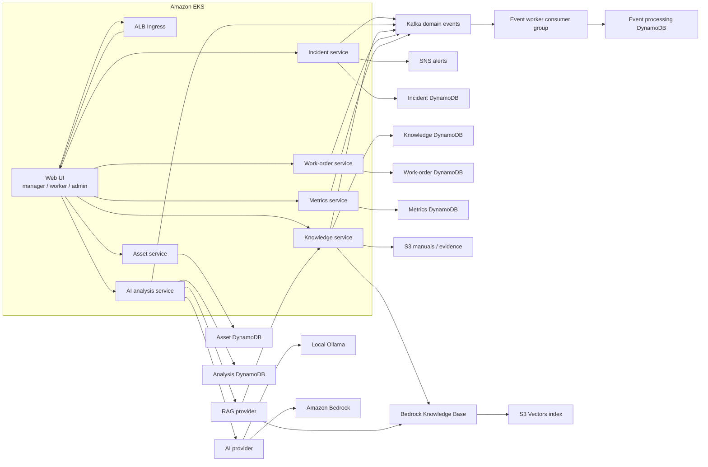
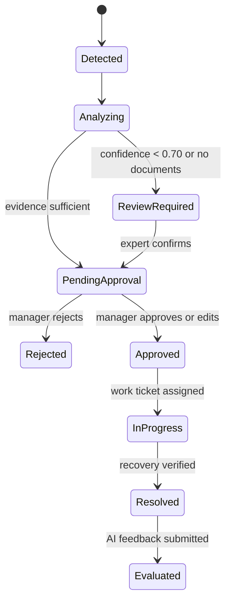

# AX Sentinel architecture

This document describes the current runtime architecture. The target design for
service-owned data, login/session flow, REST commands, and Kafka domain events is
documented in [MSA and Kafka communication design](msa-kafka-design.md).
The target Keycloak authentication and EFK centralized logging architecture is
documented in [Keycloak and EFK design](keycloak-efk-design.md).

## Goals

AX Sentinel detects virtual equipment anomalies, assists operators with
evidence-backed analysis, and controls the full response workflow through
human approval and auditable field work.

The AI is advisory. It never executes equipment operations. High-risk plans
require manager approval, and low-confidence or unsupported analyses are routed
to expert review.

## Runtime view



Each service is an independent Kubernetes Deployment and Service. Replicas are
pods, not dedicated EC2 instances. EKS managed node groups supply shared compute,
while Pod Identity gives every service a separate least-privilege IAM role.

## Persistence

Each API persists records in a service-owned DynamoDB table using:

- `pk`: `<ENTITY_TYPE>#<ENTITY_ID>`
- `sk`: `METADATA`
- `entity_type`: filtering discriminator
- `data`: versionable domain payload

The physical tables are `axsentinel-asset`, `axsentinel-incident`,
`axsentinel-analysis`, `axsentinel-knowledge`, `axsentinel-work-order`,
`axsentinel-metrics`, and `axsentinel-events`. List APIs use
`entity_type-updated_at-index` queries with pagination rather than table scans.
Conditional writes compare the record `version` so concurrent updates fail
instead of silently overwriting one another.

Services do not access another service's table. AI analysis obtains equipment,
maintenance, and documents through Asset and Knowledge REST APIs. Metrics
collects analyses, evaluations, and approvals through AI Analysis and Work
Order APIs. Work Order changes incident status through the Incident API. These
delegated synchronous calls forward the original access token so every receiving
FastAPI service repeats signature, issuer, audience, expiration, and role checks.

## Kafka event flow

LocalStack EKS runs Apache Kafka 3.9.1 as a single-node KRaft StatefulSet.
REST remains the command/query interface. After a domain write succeeds, the
owning service publishes a versioned event with `acks=all`, bounded retries, a
stable aggregate key, `event_id`, `correlation_id`, producer, actor, and
timestamp. Access tokens and passwords are never placed in the envelope.

The topics are:

- `ax.telemetry.events.v1`
- `ax.incident.events.v1`
- `ax.analysis.events.v1`
- `ax.knowledge.events.v1`
- `ax.work-order.events.v1`
- `ax.feedback.events.v1`
- `ax.audit.events.v1`
- `ax.events.dlq.v1`

`event-worker` consumes all topics as
`ax-sentinel-event-worker-v1`, persists the topic, partition, offset, event ID,
producer, correlation ID, and result, and commits offsets only after the
processing record is stored. Replayed events are skipped using the persisted
`event_id`. SQS support remains behind `EVENT_BUS=sqs|dual` for AWS migration
compatibility; Kafka is the LocalStack EKS default.

Invalid events are retried at the same offset up to three times. The worker then
stores the failure result, publishes the original value and error metadata to
`ax.events.dlq.v1`, and commits the source offset so one poison message cannot
block its partition forever.

The current implementation publishes after the domain write. A transactional
outbox that atomically stores the domain change and pending event remains the
next reliability enhancement for broker-outage recovery.

## Service boundaries

| Service | Responsibility | Main API |
| --- | --- | --- |
| asset-service | Equipment, sensors, maintenance history | `/api/v1/equipment` |
| incident-service | Virtual anomaly generation and incident lifecycle | `/api/v1/incidents` |
| ai-analysis-service | Evidence synthesis, causes, confidence and safe action plan | `/api/v1/analyses` |
| knowledge-service | Manuals, past cases and document indexing | `/api/v1/documents` |
| work-order-service | Approval, tickets and field checklist | `/api/v1/approvals` |
| metrics-service | Accuracy and usefulness feedback | `/api/v1/metrics` |

### Internal service layering

`incident-service` is the reference implementation for the server-side
structure:

```text
FastAPI router (api.py)
  → application use cases (application.py)
    → repository/event/realtime ports (ports.py)
      → DynamoDB/Kafka adapters (adapters.py)
        → shared infrastructure clients
```

Domain request, record and state-transition models live in `models.py`.
`RealtimeHub` encapsulates in-process WebSocket connections and Redis cross-pod
fan-out. `main.py` is the composition root: it creates concrete adapters,
injects them into `IncidentApplicationService`, attaches the router and owns
startup/shutdown wiring.

This applies the Ports and Adapters pattern, Repository pattern, Application
Service pattern, Dependency Injection and a Realtime Facade. The application
layer can therefore be tested with in-memory ports without FastAPI, boto3,
Kafka or Redis. Other services still use their original compact structure and
will migrate to the same layout incrementally.

### Async API and blocking workload isolation

FastAPI routes remain asynchronous, while synchronous SDK and client calls run
through `shared/concurrency.py`. Separate bounded `ThreadPoolExecutor` instances
isolate database, Kafka/SQS, AI/RAG, authentication and object-storage work.
This prevents a slow model invocation or long broker poll from occupying the
workers needed for token verification and DynamoDB requests. Python
`contextvars` are copied into each worker so correlation and request context are
preserved. Every pool is created lazily and shut down with the application
lifespan; its worker count can be tuned independently through environment
variables or Helm values.

LocalStack EKS uses Keycloak OIDC Authorization Code + PKCE authentication.
FastAPI validates Keycloak access-token signature, issuer, audience, expiration
and Realm roles against JWKS. The AWS-compatible mode continues to support
Cognito groups. Authorization roles are `operator_manager`, `field_worker`, and
`system_admin`.

Keycloak passwords are generated into the Git-ignored
`.local/keycloak-credentials.json` file and injected as Kubernetes Secrets at
deployment. The public client disables Password Grant and requires PKCE S256.
Brute-force protection, password policy, user/admin event auditing, silent token
renewal, token revocation, and mandatory TOTP enrollment for the system
administrator are enabled.

## Safety state machine



Hard invariants:

1. AI output always has `executable=false`.
2. `high` and `critical` action plans require manager approval.
3. Confidence below `0.70`, or no related documents, requires expert review.
4. A rejected plan cannot create a work order.
5. Resolution requires a completed checklist, field photo evidence, the actual
   cause, and recovery confirmation.

## Delivery stages

1. Terraform provisions network, EKS, ECR and AWS data services.
2. CI builds one image per service and pushes immutable tags to ECR.
3. Helm deploys all services to the `ax-sentinel` namespace.
4. Keycloak/OIDC locally, or Cognito/OIDC on AWS, is configured through Helm values.
5. Bedrock Converse analysis and Knowledge Bases retrieval use Pod Identity.
6. Production rollout still requires AWS provisioning, image publication,
   observability, backups, and audit-retention policy review.
