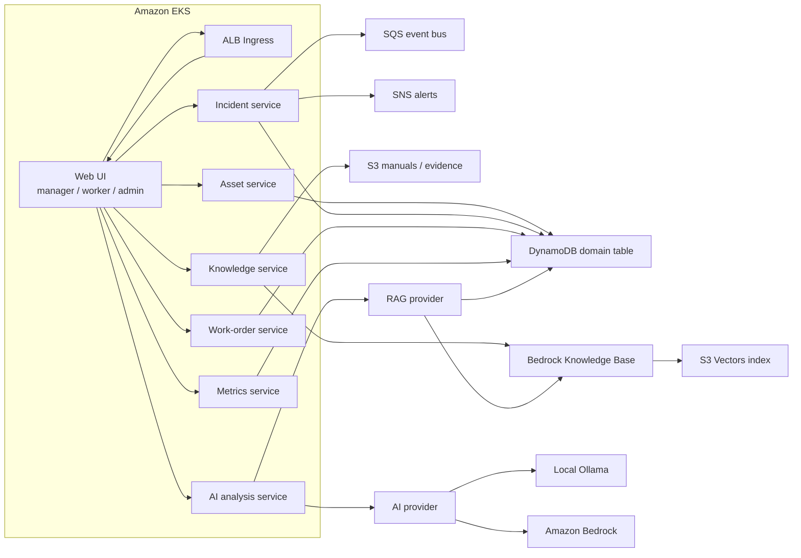
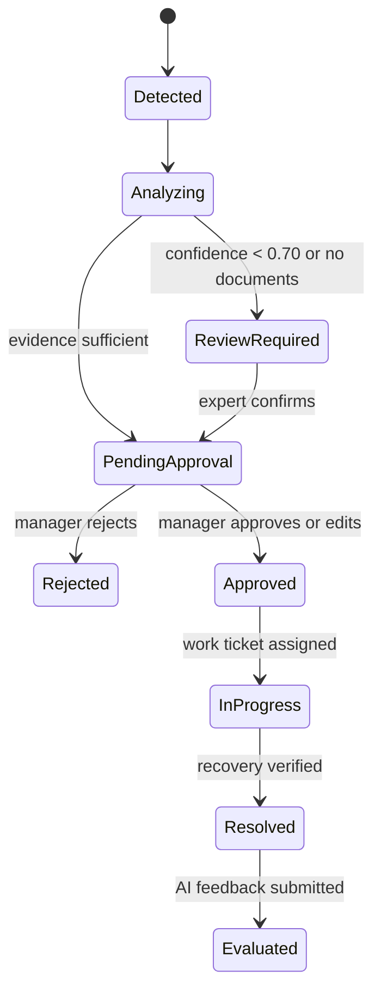

# AX Sentinel architecture

This document describes the current runtime architecture. The target design for
service-owned data, login/session flow, REST commands, and Kafka domain events is
documented in [MSA and Kafka communication design](msa-kafka-design.md).
The target Keycloak authentication and EFK centralized logging architecture is
documented in [Keycloak and EFK design](keycloak-efk-design.md).

## Goals

AX Sentinel detects virtual equipment anomalies, assists operators with
evidence-backed analysis, and controls the full response workflow through
human approval and auditable field work.

The AI is advisory. It never executes equipment operations. High-risk plans
require manager approval, and low-confidence or unsupported analyses are routed
to expert review.

## Runtime view

Each service is an independent Kubernetes Deployment and Service. Replicas are
pods, not dedicated EC2 instances. EKS managed node groups supply shared compute,
while Pod Identity gives every service a separate least-privilege IAM role.

## Persistence

The current APIs persist domain records in a shared DynamoDB table using:

- `pk`: `<ENTITY_TYPE>#<ENTITY_ID>`
- `sk`: `METADATA`
- `entity_type`: filtering discriminator
- `data`: versionable domain payload

This initial model keeps service deployment independent while using one physical
table. List APIs currently use filtered scans and must move to entity-specific
GSIs before production traffic.

## Service boundaries

| Service | Responsibility | Main API |
| --- | --- | --- |
| asset-service | Equipment, sensors, maintenance history | `/api/v1/equipment` |
| incident-service | Virtual anomaly generation and incident lifecycle | `/api/v1/incidents` |
| ai-analysis-service | Evidence synthesis, causes, confidence and safe action plan | `/api/v1/analyses` |
| knowledge-service | Manuals, past cases and document indexing | `/api/v1/documents` |
| work-order-service | Approval, tickets and field checklist | `/api/v1/approvals` |
| metrics-service | Accuracy and usefulness feedback | `/api/v1/metrics` |

Amazon Cognito provides OIDC Authorization Code + PKCE authentication for the
web client. FastAPI middleware validates access-token signatures and claims
against Cognito JWKS. Authorization roles are `operator_manager`,
`field_worker`, and `system_admin`, mapped from Cognito groups.

## Safety state machine

Hard invariants:

1. AI output always has `executable=false`.
2. `high` and `critical` action plans require manager approval.
3. Confidence below `0.70`, or no related documents, requires expert review.
4. A rejected plan cannot create a work order.
5. Resolution requires a completed checklist, field photo evidence, the actual
   cause, and recovery confirmation.

## Delivery stages

1. Terraform provisions network, EKS, ECR and AWS data services.
2. CI builds one image per service and pushes immutable tags to ECR.
3. Helm deploys all services to the `ax-sentinel` namespace.
4. Cognito/OIDC and role authorization are configured through Helm values.
5. Bedrock Converse analysis and Knowledge Bases retrieval use Pod Identity.
6. Production rollout still requires AWS provisioning, image publication,
   observability, backups, and audit-retention policy review.
