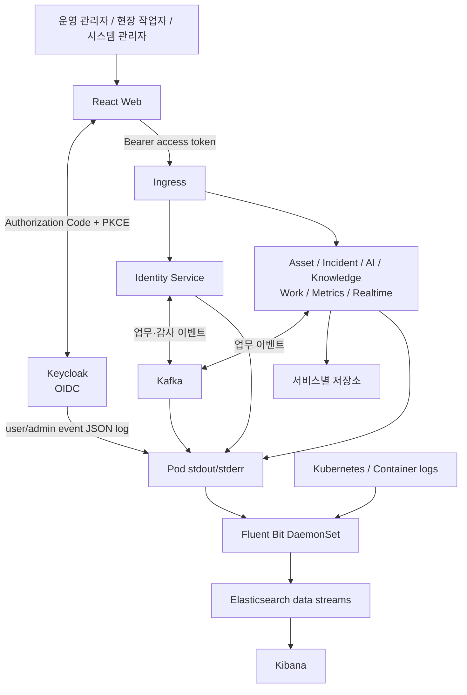
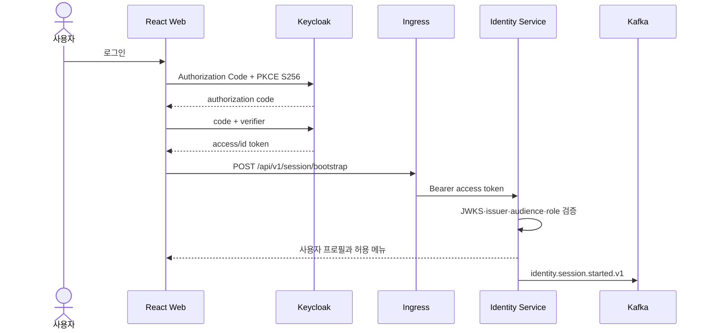

# AX Sentinel Keycloak·EFK 설계

## 1. 결정 사항

AX Sentinel의 목표 MSA 인증은 Amazon Cognito 대신 Keycloak OIDC를 사용한다.
애플리케이션, Keycloak, Kafka와 Kubernetes의 운영 로그는 EFK로 중앙 수집한다.

세 구성요소의 책임은 섞지 않는다.

| 구성요소 | 책임 | 저장하지 않는 정보 |
| --- | --- | --- |
| Keycloak | 사용자 인증, OIDC 토큰 발급, 역할과 서비스 계정 관리 | 설비·장애 업무 데이터 |
| Kafka | 서비스 간 업무 이벤트와 비동기 명령 전달 | access/refresh token, 비밀번호, 일반 애플리케이션 로그 |
| EFK | 애플리케이션·인증·인프라 로그 수집, 검색, 대시보드, 경보 | 센서 원본의 영구 저장, 업무 이벤트의 기준 원장 |

LocalStack EKS에는 Keycloak 인증이 구현되어 있다. 기존 AWS Cognito 호환
모드와 Docker Compose의 비활성 로컬 인증도 유지한다. EFK와 Kafka 부분은
아직 목표 설계이며 실제 배포 여부와 구분한다.

## 2. 전체 구조



브라우저는 Kafka나 Elasticsearch에 직접 연결하지 않는다. 모든 API 권한은
각 FastAPI 서비스가 최종 검증하고, 실시간 화면은 Realtime Gateway의
WebSocket을 사용한다.

## 3. Keycloak 인증 설계

### Realm과 Client

- Realm: `ax-sentinel`
- `ax-sentinel-web`: public OIDC client
  - Authorization Code Flow 사용
  - PKCE `S256` 필수
  - client secret을 브라우저에 배포하지 않음
  - callback, logout, web origin을 환경별 정확한 URI로 제한
- 서비스별 confidential client:
  - `svc-identity`, `svc-asset`, `svc-incident`, `svc-analysis`
  - `svc-knowledge`, `svc-work-order`, `svc-metrics`, `svc-realtime`
  - Service Account와 Client Credentials 사용
  - 하나의 공용 service secret을 여러 서비스가 공유하지 않음
- `ax-sentinel-admin-cli`: 운영 자동화 전용 confidential client
  - 일반 사용자 로그인에 사용하지 않음
  - 최소 권한과 짧은 token 수명 적용

### 사용자 역할과 API Scope

Realm role은 사용자 직무를 표현한다.

| Realm role | 사용자 |
| --- | --- |
| `operator_manager` | 장애 분석 실행, 조치안 승인·수정·반려 |
| `field_worker` | 작업 티켓 조회, 체크리스트·사진·실제 원인 등록 |
| `system_admin` | 사용자, 문서, 모델 설정과 운영 지표 관리 |

Client role 또는 scope는 API 권한을 표현한다.

- `asset.read`
- `incident.read`, `incident.write`
- `analysis.read`, `analysis.execute`, `analysis.review`
- `workorder.read`, `workorder.approve`, `workorder.complete`
- `document.read`, `document.manage`
- `metrics.read`, `metrics.evaluate`

Keycloak protocol mapper로 `roles`, `groups`, `aud`를 access token에 넣는다.
각 서비스는 issuer, signature, expiration, audience와 필요한 role/scope를
모두 검사한다. 화면에서 메뉴를 숨기는 것은 편의 기능이며 API 권한 검사를
대체하지 않는다.

### 사용자 로그인 흐름



`session/bootstrap`은 인증을 수행하지 않는다. Keycloak이 인증하고 Identity
Service는 검증된 subject를 내부 사용자 프로필에 연결한다. Kafka 감사
이벤트에는 `user_id`, `session_id`, 결과, 시각과 correlation ID만 넣는다.

로그아웃할 때 Identity Service는 종료 감사 이벤트를 Outbox로 발행하고,
Web은 Keycloak end-session endpoint를 호출한 뒤 로컬 token을 제거한다.

### 서비스 간 인증

- 동기 REST 호출은 호출 서비스의 Client Credentials token을 사용한다.
- 사용자를 대신해 권한 판단이 필요한 동기 호출은 원래 사용자 token을
  전달하고, 수신 서비스가 audience와 권한을 다시 검증한다.
- Kafka Consumer는 사용자 token을 재사용하지 않는다. 이벤트 envelope의
  `actor_id`, `actor_type`, `correlation_id`를 감사 문맥으로만 사용한다.
- JWKS는 짧게 캐시하되 Keycloak key rotation 시 다시 조회한다.
- 서비스 secret은 Kubernetes Secret 또는 외부 secret manager에 보관한다.
- Keycloak 관리자 콘솔은 별도 내부 Ingress와 관리자 네트워크로 제한한다.

### 인증 보안 정책

- 관리자와 고위험 승인 사용자에게 MFA를 적용한다.
- brute-force detection, password policy, session idle/max timeout을 활성화한다.
- Keycloak user event와 admin event를 모두 기록한다.
- 사용자 관리 권한과 AX Sentinel 업무 관리자 권한을 분리한다.
- Authorization header, cookie, authorization code, token과 비밀번호를
  어떤 로그에도 남기지 않는다.

## 4. EFK 로그 설계

여기서 EFK는 Elasticsearch, Fluent Bit, Kibana 조합을 뜻한다. Fluent Bit을
각 노드의 DaemonSet으로 실행해 `/var/log/containers`의 컨테이너 로그를
수집하고 Kubernetes metadata를 추가한 뒤 Elasticsearch로 전송한다.

### 애플리케이션 로그 형식

모든 FastAPI 서비스는 한 줄 JSON을 stdout/stderr로 출력한다.

```json
{
  "@timestamp": "2026-07-27T10:00:00.000Z",
  "log.level": "INFO",
  "service.name": "incident-service",
  "deployment.environment": "local",
  "trace.id": "trace-...",
  "correlation.id": "corr-...",
  "event.id": "evt-...",
  "http.request.method": "POST",
  "url.path": "/api/v1/incidents",
  "http.response.status_code": 202,
  "event.duration": 18200000,
  "user.id_hash": "sha256:...",
  "message": "incident analysis accepted"
}
```

`message`는 사람이 읽을 수 있는 요약이고 검색·집계 필드는 별도로 둔다.
서비스 이름, 환경, log level, trace/correlation/event ID, route, status,
duration을 공통 필드로 강제한다.

### Data Stream

| Data stream | 내용 |
| --- | --- |
| `logs-axsentinel-app-default` | FastAPI, React ingress와 worker 로그 |
| `logs-axsentinel-keycloak-default` | 로그인, 로그아웃, 인증 실패, 관리자 변경 |
| `logs-axsentinel-kafka-default` | broker, producer, consumer, lag와 rebalance |
| `logs-axsentinel-audit-default` | 승인, 반려, 전문가 배정 등 감사 projection |
| `logs-axsentinel-security-default` | 인증 실패 급증, 접근 거부와 보안 경보 |

감사 data stream은 Kafka 업무 이벤트를 그대로 복제하는 원장이 아니다.
Audit Consumer가 필요한 필드만 투영하며 token과 민감 원문은 제외한다.

### 수집 파이프라인

1. 애플리케이션과 Keycloak이 JSON을 stdout/stderr로 출력한다.
2. 컨테이너 runtime이 노드의 container log 파일에 기록한다.
3. Fluent Bit DaemonSet이 tail하고 Kubernetes namespace, pod, container
   metadata를 보강한다.
4. parser/filter가 multiline을 합치고 민감 필드를 제거한다.
5. Elasticsearch data stream에 bulk 전송한다.
6. Kibana에서 검색, dashboard와 alert를 제공한다.

Fluent Bit 전송 실패 시 filesystem buffer를 사용한다. 버퍼 한계 초과 시
애플리케이션 요청을 막지 않고 drop count를 metric과 경보로 노출한다.

### 마스킹과 금지 필드

다음 값은 수집 전에 삭제하거나 비가역 hash로 바꾼다.

- access token, refresh token, ID token, authorization code
- `Authorization`, `Cookie`, `Set-Cookie` header
- 비밀번호, client secret, AWS credential
- 매뉴얼·과거 사례의 전체 본문, RAG prompt 전체
- 현장 사진 binary/base64와 presigned URL query
- 센서 원본 전체 payload
- 이름, 이메일, 전화번호 등 직접 식별자

오류 stack trace에도 request header/body가 섞이지 않도록 예외 middleware를
통제한다. `user.id_hash`는 환경별 salt를 사용해 운영자 검색 가능성과 개인
정보 보호를 함께 만족시킨다.

### 보존 정책 초안

| 로그 | Local/개발 | 운영 |
| --- | --- | --- |
| 일반 애플리케이션 | 7일 / 14일 | 30일 |
| Kafka·Kubernetes 인프라 | 7일 / 14일 | 30일 |
| 인증·보안 | 30일 | 365일 |
| 업무 감사 projection | 30일 | 365일 |

운영 보존 기간은 개인정보, 보안, 산업 규정과 회사 정책 검토 후 확정한다.
Elasticsearch ILM/data stream lifecycle로 rollover와 삭제를 자동화한다.

### Kibana Dashboard와 경보

- API: 요청량, p50/p95/p99 latency, 4xx/5xx, 느린 endpoint
- AI: queue time, Ollama/Bedrock latency, timeout, 신뢰도와 전문가 검토율
- Kafka: consumer lag, rebalance, publish 실패, retry와 DLQ
- Keycloak: 로그인 성공/실패, 계정 잠금, brute-force 의심, admin 변경
- 업무 흐름: correlation ID 기준 장애 감지부터 작업 완료까지
- EFK 자체: Fluent Bit retry/drop, Elasticsearch ingest 오류와 disk watermark

경보는 로그인 실패 급증, 5xx 비율, AI timeout, DLQ 유입, consumer lag,
Elasticsearch ingest 중단에 설정한다.

EFK는 metric과 distributed trace를 대체하지 않는다. Prometheus/Grafana로
수치 경보를, OpenTelemetry로 trace를 수집하고 Kibana 로그와 같은
`trace.id`·`correlation.id`로 연결한다.

## 5. 배포 구조

### 로컬 EKS

- `keycloak` namespace: Keycloak과 개발용 PostgreSQL
- `ax-sentinel` namespace: React와 FastAPI MSA
- `kafka` namespace: KRaft/Strimzi Kafka
- `observability` namespace: single-node Elasticsearch, Kibana, Fluent Bit
- realm/client/role은 version-controlled realm import로 재현한다.
- 개발 secret은 샘플 값과 실제 값을 분리하고 Git에 실제 값을 저장하지 않는다.

LocalStack은 AWS API를 에뮬레이션하지만 Keycloak, Kafka와 EFK 자체를
에뮬레이션하지 않는다. 이 구성요소들은 로컬 Kubernetes workload로 직접
실행한다.

### AWS EKS

- Keycloak은 다중 replica와 RDS PostgreSQL Multi-AZ를 사용한다.
- Keycloak external login Ingress와 internal admin Ingress를 분리한다.
- Kafka는 Amazon MSK로 교체하되 동일 topic/schema를 유지한다.
- EFK는 ECK 기반 Elasticsearch 또는 승인된 managed Elastic을 사용한다.
- 서비스 간 TLS, Keycloak/Elasticsearch secret rotation, encrypted storage,
  snapshot/restore와 AZ 분산을 적용한다.

## 6. 구현 순서

| 순서 | 구현 | 완료 기준 |
| --- | --- | --- |
| 1 | Keycloak 로컬 배포, realm/client/role import | React PKCE 로그인과 3개 역할별 API 접근 시험 |
| 2 | 공통 FastAPI OIDC verifier와 Identity Service | issuer/audience/role, key rotation, `/me` 시험 |
| 3 | JSON logging과 EFK 기본 배포 | 서비스·Keycloak 로그가 Kibana에서 correlation ID로 검색됨 |
| 4 | Kafka 공통 event library와 Inbox/Outbox | 중복 이벤트와 broker 중단 복구 시험 |
| 5 | 로그인 감사·Incident dual publish | Identity/Incident 이벤트와 EFK 로그의 연계 검색 |
| 6 | AI 분석 비동기화와 Realtime WebSocket | REST 202, Kafka 완료 event, UI 실시간 갱신 |
| 7 | 승인·작업 Saga와 감사 projection | 고위험 승인부터 작업 완료까지 추적 |
| 8 | 운영 강화 | MSK, HA Keycloak, ILM, 경보, backup/restore 시험 |

기존 Cognito 코드는 1~2단계가 통합 시험을 통과할 때까지 feature flag 뒤에
유지한다. 이후 Keycloak을 기본 provider로 바꾸고 Cognito 전용 Terraform과
환경 변수를 별도 정리 작업으로 제거한다.

## 7. 인수 기준

- 브라우저가 Keycloak Authorization Code + PKCE로 로그인한다.
- `operator_manager`, `field_worker`, `system_admin` 역할별 UI와 API 권한이
  일치하며 권한 없는 직접 API 호출은 403을 반환한다.
- 서비스 계정은 자신의 audience/scope 밖 API를 호출할 수 없다.
- token, 비밀번호, secret과 민감 본문이 Kafka와 Elasticsearch에 없다.
- 로그인 실패, API 요청, Kafka event와 WebSocket 알림이 하나의 correlation
  ID로 추적된다.
- Fluent Bit 또는 Elasticsearch 재시작 후 buffer의 로그가 복구된다.
- Kibana에서 Keycloak 인증, API 오류, Kafka lag, AI timeout과 감사 흐름을
  확인할 수 있다.
- 고위험 조치는 관리자 승인 없이는 작업 티켓으로 전환되지 않는다.
