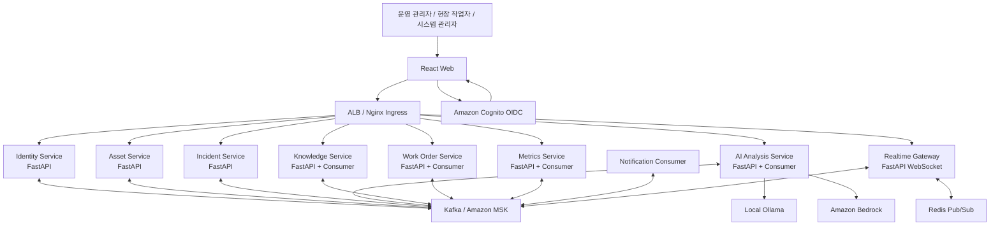
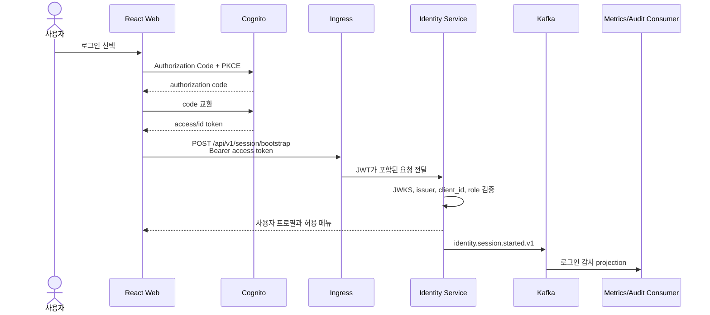
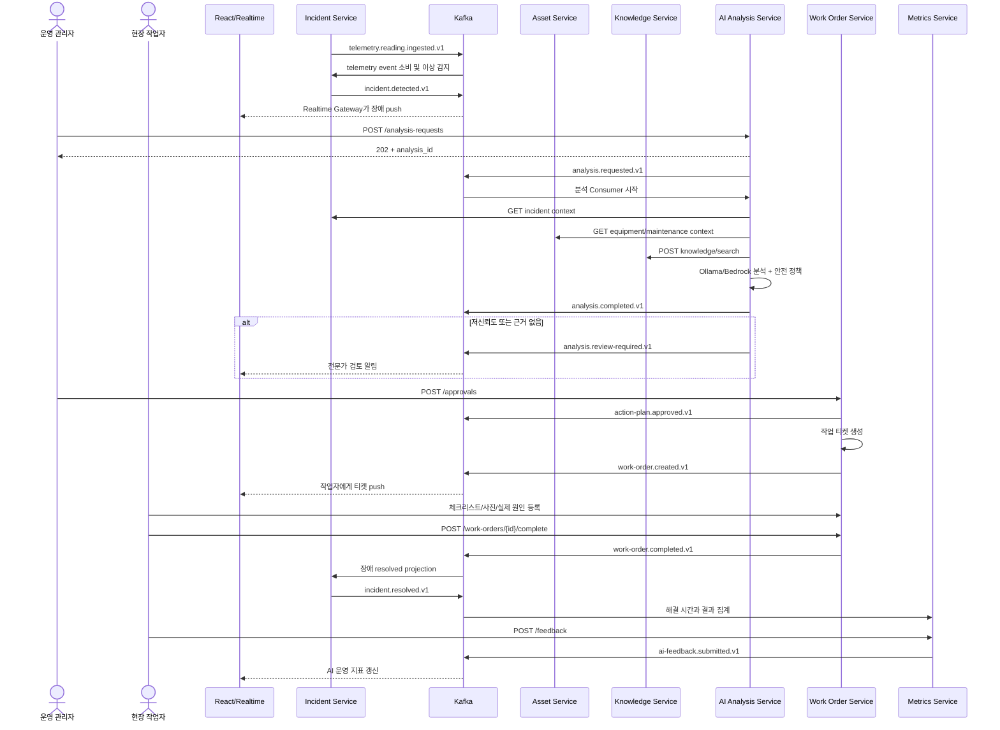

# AX Sentinel MSA 및 Kafka 통신 설계

## 1. 목적

이 문서는 AX Sentinel을 다음 원칙의 MSA로 발전시키기 위한 목표 설계를
정의한다.

- 로그인부터 장애 해결과 AI 평가까지 사용자·서비스 흐름을 추적한다.
- 즉시 결과가 필요한 요청은 REST로 처리한다.
- 서비스 상태 변화와 장기 실행 작업은 Kafka 이벤트로 전달한다.
- 각 서비스가 자신의 데이터만 소유하고 다른 서비스의 저장소를 직접 읽지
  않도록 한다.
- 메시지 중복, 순서 변경, 재처리와 장애 복구를 기본 전제로 설계한다.
- AI는 진단을 지원하지만 설비 제어와 고위험 조치를 직접 실행하지 않는다.

이번 단계는 목표 설계이며 Kafka 클러스터나 신규 서비스를 즉시 배포하는
구현 단계는 아니다.

## 2. 핵심 결정

### REST와 Kafka의 역할

| 통신 종류 | 사용 기술 | 적용 사례 |
| --- | --- | --- |
| 사용자 명령·조회 | REST/JSON | 로그인 세션 확인, 장애 조회, 승인, 작업 완료 |
| 오래 걸리는 명령 접수 | REST `202 Accepted` | AI 분석 요청, 문서 색인 요청 |
| 서비스 상태 변화 | Kafka event | 장애 감지, 분석 완료, 승인, 작업 완료 |
| 대용량 센서 스트림 | Kafka event | 센서 원본 및 정규화 데이터 |
| 브라우저 실시간 갱신 | WebSocket | 센서값, 장애, 분석 상태, 작업 상태 |
| Pod 간 WebSocket fan-out | Redis Pub/Sub | 여러 Realtime Pod로 UI 메시지 복제 |
| 외부 모델 호출 | HTTP API/AWS SDK | Ollama, Amazon Bedrock |

Kafka는 REST를 완전히 대체하지 않는다. 로그인, 권한 확인, 사용자 승인처럼
즉시 성공 여부가 필요한 요청은 REST를 유지한다. Kafka에는 비밀번호, access
token, refresh token과 같은 인증 비밀을 절대 기록하지 않는다.

### 전달 보장

- Kafka 전달 보장은 `at-least-once`를 기본으로 한다.
- 모든 이벤트에는 고유한 `event_id`를 포함한다.
- Consumer는 Inbox에 처리된 `event_id`를 저장해 멱등성을 보장한다.
- 상태 저장과 이벤트 발행은 Transactional Outbox로 원자화한다.
- “정확히 한 번 전송”을 가정하지 않고 “중복되어도 결과가 한 번만 반영”되게
  구현한다.

## 3. 목표 시스템 구성



### 로컬 및 AWS 배치

| 환경 | Kafka | AI | 인증 |
| --- | --- | --- | --- |
| LocalStack EKS | KRaft 기반 로컬 Kafka 또는 Strimzi Kafka | Ollama | 개발 모드 또는 LocalStack Cognito |
| AWS 개발/운영 | Amazon MSK Serverless/Provisioned | Bedrock | Amazon Cognito |
| 자동화 테스트 | Testcontainers Kafka | deterministic mock | 테스트 principal |

Kafka는 AWS API 에뮬레이터가 아니라 Kafka protocol을 직접 사용한다. 로컬
EKS에서는 Kafka broker를 별도 StatefulSet으로 실행하고 운영에서는 Amazon
MSK로 endpoint만 교체한다.

## 4. 서비스 경계와 데이터 소유권

현재 하나의 DynamoDB 테이블을 모든 서비스가 직접 읽는 방식은 초기
프로토타입에는 단순하지만 서비스 결합도가 높다. 목표 구조에서는 다음처럼
소유권을 분리한다.

| 서비스 | 소유 데이터 | 다른 서비스 제공 방식 |
| --- | --- | --- |
| Identity Service | 사용자 프로필, 역할 캐시, 로그인 감사 이력 | REST `/me`, identity events |
| Asset Service | 설비, 센서 사양, 정비 이력 | REST 조회, asset events |
| Incident Service | telemetry, 이상 감지 상태, 장애 상태 | REST 조회/명령, incident events |
| AI Analysis Service | 분석 요청·결과, 프롬프트 감사, 전문가 검토 | REST 조회/명령, analysis events |
| Knowledge Service | 문서 메타데이터, 색인 작업, 검색 인터페이스 | REST search, knowledge events |
| Work Order Service | 승인, 작업 티켓, 체크리스트, 현장 증적 | REST 명령, work-order events |
| Metrics Service | 피드백, 평가 실행, 집계 projection | REST 조회, metric events |
| Realtime Gateway | 영속 데이터 없음 | Kafka 소비 후 WebSocket push |
| Notification Consumer | 알림 전송 이력 | incident/work-order event 소비 |

각 서비스는 별도 DynamoDB table을 사용하거나 최소한 자신만 접근 가능한
partition과 IAM policy를 사용한다. 다른 서비스의 table을 직접 조회하지
않는다.

## 5. 인증 및 로그인 설계

### 사용자 로그인



`session/bootstrap`은 Cognito 로그인을 대신하지 않는다. Cognito가 인증을
담당하고 Identity Service는 검증된 claim을 내부 사용자 프로필과 연결하며
로그인 감사 이벤트를 생성한다.

### 로그아웃

1. Web이 `POST /api/v1/session/end`를 호출한다.
2. Identity Service가 `identity.session.ended.v1`을 발행한다.
3. Web이 Cognito logout endpoint로 이동하고 로컬 token을 제거한다.
4. Kafka 이벤트에는 token이 아닌 `user_id`, `session_id`, 시각과 결과만
   기록한다.

### 서비스 간 인증

- 사용자 요청을 대신 수행하는 동기 REST 호출은 원본 access token과
  `trace_id`를 전달한다.
- 백그라운드 Consumer 호출은 사용자 token을 재사용하지 않는다.
- 서비스 간 호출은 Kubernetes ServiceAccount 기반 workload identity와
  mTLS 또는 짧은 수명의 internal service JWT를 사용한다.
- `X-User-Id`, `X-Role` 같은 header만 단독으로 신뢰하지 않는다.
- 각 FastAPI 서비스는 최종 권한을 다시 검사한다.

## 6. 로그인부터 장애 해결까지 전체 흐름



### 동기 호출을 허용하는 이유

AI 분석 시점에는 최신 장애, 설비와 문서 내용이 즉시 필요하다. 초기 구현은
AI Analysis Service가 각 소유 서비스의 read API를 호출한다. 트래픽이
증가하면 `asset.snapshot.updated`, `maintenance.recorded`,
`incident.context.updated` 이벤트를 이용해 Analysis Service 내부에
읽기 전용 context projection을 만들고 동기 의존성을 줄인다.

## 7. REST API 계약

### Identity Service

| Method | Path | 결과 |
| --- | --- | --- |
| `POST` | `/api/v1/session/bootstrap` | token 검증, 프로필/역할 반환 |
| `POST` | `/api/v1/session/end` | 로그아웃 감사 이벤트 접수 |
| `GET` | `/api/v1/me` | 현재 사용자와 역할 |

### 비동기 명령 접수

AI 분석과 문서 색인처럼 오래 걸리는 작업은 즉시 결과를 기다리지 않는다.

```http
POST /api/v1/analysis-requests
Idempotency-Key: <uuid>

HTTP/1.1 202 Accepted
Location: /api/v1/analyses/<analysis_id>
```

```json
{
  "analysis_id": "analysis-uuid",
  "status": "queued",
  "submitted_at": "2026-07-27T03:00:00Z"
}
```

Web은 WebSocket 이벤트를 우선 사용하고 연결이 끊긴 경우에만 `GET
/api/v1/analyses/{id}`로 상태를 복구한다.

### 내부 REST 규칙

- timeout, circuit breaker와 bounded retry를 적용한다.
- 변경 요청은 `Idempotency-Key`를 받는다.
- 모든 요청은 `traceparent` 또는 `X-Correlation-Id`를 전달한다.
- Consumer 처리 중 동기 호출이 실패하면 무한 재시도하지 않고 retry topic으로
  이동한다.

## 8. Kafka topic 설계

Topic 이름은 `<platform>.<domain>.<stream>.v<major>` 형식을 사용한다.

| Topic | Partition key | 주요 Producer | 주요 Consumer | 기본 보존 |
| --- | --- | --- | --- | --- |
| `ax.identity.events.v1` | `user_id` | Identity | Audit, Metrics | 30일 |
| `ax.asset.events.v1` | `equipment_id` | Asset | Analysis projection | 30일 |
| `ax.telemetry.readings.v1` | `equipment_id` | Incident/IoT adapter | Anomaly detector, Realtime | 7일 |
| `ax.incident.events.v1` | `incident_id` | Incident | Analysis, Realtime, Notification | 90일 |
| `ax.analysis.commands.v1` | `incident_id` | Analysis API | Analysis worker | 7일 |
| `ax.analysis.events.v1` | `incident_id` | Analysis worker | Realtime, Metrics, Notification | 90일 |
| `ax.knowledge.events.v1` | `document_id` | Knowledge | Analysis projection, Realtime | 30일 |
| `ax.work-order.events.v1` | `incident_id` | Work Order | Incident, Realtime, Metrics | 365일 |
| `ax.feedback.events.v1` | `analysis_id` | Metrics | Evaluation pipeline | 365일 |
| `ax.audit.events.v1` | `actor_id` | 모든 서비스 | Audit sink | 정책에 따라 장기 보관 |

### Retry와 DLQ

각 domain topic은 공통 retry/DLQ 규칙을 사용한다.

```text
ax.analysis.commands.v1
  → ax.analysis.commands.retry-1m.v1
  → ax.analysis.commands.retry-10m.v1
  → ax.analysis.commands.dlq.v1
```

- 역직렬화 실패, schema 위반은 즉시 DLQ로 이동한다.
- 일시적인 네트워크 오류는 지수 backoff retry topic으로 이동한다.
- 업무 규칙 위반은 재시도하지 않고 실패 이벤트를 발행한다.
- DLQ 재처리는 관리자 API에서 대상 `event_id`를 지정해 수행한다.

## 9. 이벤트 계약

초기에는 Pydantic model에서 JSON Schema를 생성한다. 로컬은 Apicurio
Schema Registry, AWS는 AWS Glue Schema Registry를 사용할 수 있다.

### 공통 envelope

```json
{
  "event_id": "019f-event-uuid",
  "event_type": "analysis.completed",
  "event_version": 1,
  "occurred_at": "2026-07-27T03:10:00Z",
  "producer": "ai-analysis-service",
  "aggregate_type": "analysis",
  "aggregate_id": "analysis-uuid",
  "partition_key": "incident-uuid",
  "correlation_id": "incident-uuid",
  "causation_id": "analysis-request-event-id",
  "actor": {
    "type": "user",
    "id": "manager-sub"
  },
  "data": {}
}
```

### 이벤트 규칙

- `event_type`은 과거형 상태 변화로 작성한다.
- 기존 필드 의미를 변경하지 않고 새 필드는 optional로 추가한다.
- 호환되지 않는 변경은 새 major topic을 만든다.
- 이벤트에는 문서 본문, 사진 binary, access token과 비밀번호를 넣지 않는다.
- 큰 데이터는 S3 object key와 hash만 포함한다.
- AI 이벤트에는 모델 ID, 프롬프트 버전, 문서 버전과 Guardrail 결과를
  포함한다.

### 핵심 이벤트

```text
identity.session.started
identity.session.ended
telemetry.reading.ingested
incident.detected
incident.status-changed
analysis.requested
analysis.started
analysis.completed
analysis.failed
analysis.review-required
expert-review.assigned
expert-review.completed
action-plan.approved
action-plan.rejected
work-order.created
work-order.started
work-order.completed
incident.resolved
ai-feedback.submitted
evaluation.completed
document.uploaded
document.indexed
```

## 10. Transactional Outbox와 멱등성

### Producer

서비스의 업무 데이터와 Outbox record를 하나의 DynamoDB
`TransactWriteItems`로 저장한다.

```text
업무 레코드 저장
  + OUTBOX#<event_id> 저장
  = 하나의 DynamoDB transaction
```

Outbox Publisher가 미발행 record를 Kafka로 전송한 후 published 상태를
기록한다. Publisher가 전송 직후 죽으면 같은 이벤트가 다시 전송될 수 있으므로
Consumer 멱등성이 필수다.

### Consumer

1. event schema를 검증한다.
2. Inbox에서 `event_id` 처리 여부를 확인한다.
3. 미처리 이벤트만 domain 로직에 적용한다.
4. domain 변경과 Inbox 저장을 하나의 transaction으로 처리한다.
5. 성공 후 Kafka offset을 commit한다.

업무 엔터티에는 `version`을 두어 오래된 이벤트가 최신 상태를 덮어쓰지 않게
한다.

## 11. 실시간 전송 설계

브라우저가 Kafka에 직접 접속하지 않는다.

1. Realtime Gateway가 UI에 필요한 topic을 소비한다.
2. `user_id`, `role`, `equipment_id` 기준으로 이벤트를 필터링한다.
3. Redis Pub/Sub으로 여러 Gateway Pod에 fan-out한다.
4. FastAPI WebSocket이 연결된 브라우저로 전송한다.
5. WebSocket 재연결 시 REST snapshot과 마지막 `event_id`로 화면을 복구한다.

Telemetry 원본 전체를 모든 브라우저에 전송하지 않고 화면에서 구독한
설비·센서만 전달한다.

## 12. 관측성과 운영

모든 REST 요청과 Kafka 이벤트는 같은 `correlation_id`를 사용한다.

필수 지표:

- REST latency, error rate, timeout
- Kafka producer error와 publish latency
- Consumer lag, 처리량, retry와 DLQ 건수
- Outbox pending age와 pending count
- 이벤트 처리 시간
- AI queue time, inference time와 실패율
- WebSocket 연결 수와 전달 지연

OpenTelemetry trace에는 다음 구간이 하나의 흐름으로 보여야 한다.

```text
POST analysis request
  → outbox
  → Kafka
  → analysis consumer
  → Asset/Knowledge REST
  → Ollama/Bedrock
  → analysis.completed
  → WebSocket
```

로그에는 token, 비밀번호, 문서 원문과 현장 사진을 남기지 않는다.

## 13. 장애 시나리오

| 장애 | 기대 동작 |
| --- | --- |
| Kafka 일시 중단 | Outbox에 이벤트 유지, REST 업무 데이터 보존 |
| Consumer 중단 | lag 증가 후 재시작 지점부터 처리 |
| 같은 이벤트 중복 | Inbox 확인 후 두 번째 처리는 no-op |
| 이벤트 순서 역전 | aggregate version이 낮으면 무시 |
| Ollama/Bedrock timeout | `analysis.failed`, retry 또는 전문가 수동 분석 |
| Knowledge Service 장애 | 분석을 대기시키거나 `no_documents`로 전문가 검토 |
| WebSocket 연결 종료 | REST snapshot으로 복구 후 재구독 |
| Schema 불일치 | DLQ 저장 및 운영 경보 |

## 14. 현재 구조에서의 전환 순서

### 1단계: 공통 이벤트 기반

- `shared/events.py`에 Kafka Producer/Consumer abstraction 추가
- 공통 envelope와 Pydantic event schema 추가
- `correlation_id`, `causation_id`, `event_id` 표준화
- 로컬 Kafka와 Schema Registry Helm 구성 추가
- SQS publisher를 feature flag로 유지해 비교 가능하게 구성

### 2단계: Identity와 로그인 흐름

- Identity Service와 `/session/bootstrap`, `/session/end`, `/me` 추가
- Cognito claim과 내부 사용자 프로필·역할 연결
- 로그인/로그아웃 감사 이벤트를 Outbox로 발행
- token·비밀번호 미기록과 역할별 API 접근 시험

### 3단계: Incident 이벤트 전환

- `incident.detected`를 Kafka와 기존 SQS에 dual publish
- Kafka Consumer 처리 이력과 Inbox 구현
- 결과 비교 후 SQS Event Worker를 Kafka Consumer로 교체
- Telemetry topic과 anomaly consumer 분리

### 4단계: 비동기 AI 분석

- `POST /analysis-requests`를 `202 Accepted` 방식으로 변경
- `analysis.commands` Consumer가 Ollama/Bedrock 실행
- 분석 진행 상태를 Kafka와 WebSocket으로 전송
- retry/DLQ와 timeout 정책 적용

### 5단계: 승인과 작업 Saga

- 승인 후 `action-plan.approved` 이벤트 발행
- Work Order Service가 티켓 생성
- `work-order.completed`를 Incident와 Metrics가 각각 소비
- 보상 동작과 수동 재처리 API 추가

### 6단계: 데이터 소유권 분리

- 서비스별 DynamoDB table/IAM policy 분리
- 타 서비스 table 직접 접근을 REST 또는 projection으로 교체

### 7단계: 운영 전환

- Amazon MSK, Glue Schema Registry, TLS/SASL 적용
- Consumer lag, Outbox, DLQ 대시보드와 경보 추가
- dual publish 결과 검증 후 SQS domain event 경로 제거
- 부하·장애·재처리·schema 호환성 시험 수행

## 15. 구현 우선순위

| 순서 | 구현 항목 | 완료 조건 |
| --- | --- | --- |
| 1 | Kafka 로컬 클러스터와 공통 event library | 샘플 event publish/consume |
| 2 | Kafka Inbox/Outbox | 중복 이벤트 테스트 통과 |
| 3 | Identity Service | 로그인 bootstrap, 역할, 감사 이벤트 |
| 4 | Incident dual publish | SQS/Kafka payload 비교 통과 |
| 5 | AI 분석 비동기화 | REST 202, Kafka 완료, UI push |
| 6 | Work Order Saga | 승인부터 장애 해결까지 이벤트 연결 |
| 7 | 서비스별 데이터 소유권 | 교차 table 접근 제거 |
| 8 | MSK 운영 구성 | TLS/SASL, lag/DLQ 경보 검증 |

## 16. 수용 기준

- 로그인 후 사용자 역할에 맞는 메뉴와 API 권한이 반환된다.
- token과 비밀번호가 Kafka topic과 로그에 포함되지 않는다.
- 장애 한 건의 모든 이벤트를 하나의 `correlation_id`로 추적할 수 있다.
- Kafka가 중단되어도 REST로 저장된 업무 데이터와 Outbox가 유실되지 않는다.
- 같은 이벤트를 두 번 전달해도 작업 티켓과 피드백이 중복 생성되지 않는다.
- AI 분석 요청은 즉시 `202`를 반환하고 완료 결과가 WebSocket으로 전달된다.
- Consumer 재시작 후 마지막 commit offset부터 처리를 재개한다.
- Schema 비호환 이벤트는 DLQ로 이동한다.
- 고위험 조치가 관리자 승인 없이 작업 티켓으로 전환되지 않는다.
- 서비스가 다른 서비스의 DynamoDB table을 직접 읽지 않는다.
